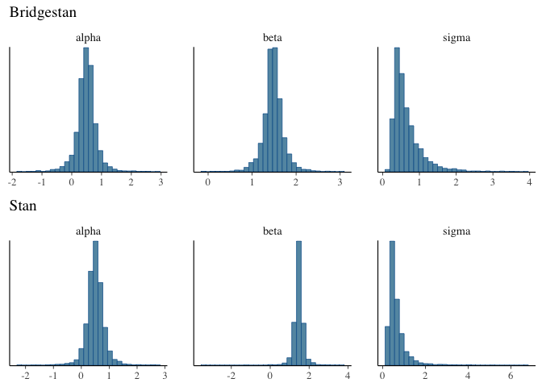

<!-- README.md is generated from README.Rmd. Please edit that file -->

# hmcSandbox

<!-- badges: start -->
<!-- badges: end -->

The hmcSandbox provides a customizable R-implementation of the
[NUTS-sampler](https://arxiv.org/abs/1111.4246) which allows the user to
extract sampler diagnostics from each algorithm step.

## Installation

The hmcSanbox is built using the Bridgestan and Cmdstan frameworks,
which both needs to be installed before the package can be used.

Installation links:

- Bridgestan: <https://github.com/roualdes/bridgestan>

- Cmdstan: <https://mc-stan.org/users/interfaces/cmdstan>

The development version of hmcSandbox can then be installed from
[GitHub](https://github.com/) with:

``` r
# install.packages("devtools")
devtools::install_github("JTorgander/hmc-sandbox")
```

## Demonstration

### Loading models

In order to use a given stan-model within the hmc-sandbox, the
corresponding stan file `model_name.stan` needs to be placed in a named
folder `model_name`. This folder should also contain the input data in a
JSON-file named `model_name.data.json`. This folder should in turn be
placed in the folder `test_models` in the bridgestan directory.

To illustrate this we will use the bridgestan test model `regression`,
defined as follows:

``` r
"data {
  int<lower=0> N;
  vector[N] x;
  vector[N] y;
}
parameters {
  real alpha;
  real beta;
  real<lower=0> sigma;
}
transformed parameters {
  vector[N] mu = alpha + beta * x;
}
model {
  alpha ~ normal(0, 5);
  beta ~ normal(0, 3);
  sigma ~ cauchy(0, 1.5);
  y ~ normal(mu, sigma);
}
generated quantities {
  real x_gen = normal_rng(0, 2);
  real y_gen = normal_rng(alpha + beta * x_gen, sigma);
}"
```

For this model, the bridgestan test_models folder contains a folder
`regression`, which in turn contains one model file `regression.stan`
and one data file `regression.data.json`.

Before the stan model can be used within bridgestan, the .stan file
needs to be compiled in to compiled shared object `.so` file. For mac
users the model can be compiled with the following function.

``` r
library(hmcSandbox)
BS_PATH <- "~/Documents/bridgestan"
model_name <- "regression"
compile_bs(model_name=model_name, bridgestan_path=BS_PATH)
```

Here the argument “bridgestan_path” should be set to the bridgestan
install directory. Other users are referred to the bridgestan
[documentation](https://github.com/roualdes/bridgestan). Note that the
model needs to be recompiled whenever the `.stan` file is modified. The
compiled model can now be loaded using the following function.

``` r
model <- get_model(model_name, model_seed = 1234, data=TRUE, bridgestan_path=BS_PATH)
#> Loading Bridgestan model
#> Models loaded!
```

Setting `data=TRUE` here indicates that the data.json file featured in
the model folder should be used when loading the model.

### Sampling

Having loaded the model obejct, we can now sample from the loaded model
using the following code:

``` r
bs_fit <- NUTS(model = model, n_samples = 4000, warm_up = 2000)
#> Initializing model..
#> 
#> Initialization messages:
#> Warning: E-BFMI not computed because it is undefined for posterior chains of
#> length less than 3.
#> 
#> 
#> Model initialized!
#> Generating samples..
#> 400 out of 4000 samples generated
#> 800 out of 4000 samples generated
#> 1200 out of 4000 samples generated
#> 1600 out of 4000 samples generated
#> 2000 out of 4000 samples generated
#> 2400 out of 4000 samples generated
#> 2800 out of 4000 samples generated
#> 3200 out of 4000 samples generated
#> 3600 out of 4000 samples generated
#> 4000 out of 4000 samples generated
#> Sampling completed!
```

This will yield 4000 samples using a burn-in/initialization period of
2000 samples. For reference purposes, the model object also contains the
original cmdstan model. This model can in turn be sampled from as before
using the `sample` method:

``` r
stan_fit <- model$stan_model$sample(data = model$data, chains = 1, iter_sampling = 4000)
#> Running MCMC with 1 chain...
#> 
#> Chain 1 Iteration:    1 / 5000 [  0%]  (Warmup) 
#> Chain 1 Iteration:  100 / 5000 [  2%]  (Warmup) 
#> Chain 1 Iteration:  200 / 5000 [  4%]  (Warmup) 
#> Chain 1 Iteration:  300 / 5000 [  6%]  (Warmup) 
#> Chain 1 Iteration:  400 / 5000 [  8%]  (Warmup) 
#> Chain 1 Iteration:  500 / 5000 [ 10%]  (Warmup) 
#> Chain 1 Iteration:  600 / 5000 [ 12%]  (Warmup) 
#> Chain 1 Iteration:  700 / 5000 [ 14%]  (Warmup) 
#> Chain 1 Iteration:  800 / 5000 [ 16%]  (Warmup) 
#> Chain 1 Iteration:  900 / 5000 [ 18%]  (Warmup) 
#> Chain 1 Iteration: 1000 / 5000 [ 20%]  (Warmup) 
#> Chain 1 Iteration: 1001 / 5000 [ 20%]  (Sampling) 
#> Chain 1 Iteration: 1100 / 5000 [ 22%]  (Sampling) 
#> Chain 1 Iteration: 1200 / 5000 [ 24%]  (Sampling) 
#> Chain 1 Iteration: 1300 / 5000 [ 26%]  (Sampling) 
#> Chain 1 Iteration: 1400 / 5000 [ 28%]  (Sampling) 
#> Chain 1 Iteration: 1500 / 5000 [ 30%]  (Sampling) 
#> Chain 1 Iteration: 1600 / 5000 [ 32%]  (Sampling) 
#> Chain 1 Iteration: 1700 / 5000 [ 34%]  (Sampling) 
#> Chain 1 Iteration: 1800 / 5000 [ 36%]  (Sampling) 
#> Chain 1 Iteration: 1900 / 5000 [ 38%]  (Sampling) 
#> Chain 1 Iteration: 2000 / 5000 [ 40%]  (Sampling) 
#> Chain 1 Iteration: 2100 / 5000 [ 42%]  (Sampling) 
#> Chain 1 Iteration: 2200 / 5000 [ 44%]  (Sampling) 
#> Chain 1 Iteration: 2300 / 5000 [ 46%]  (Sampling) 
#> Chain 1 Iteration: 2400 / 5000 [ 48%]  (Sampling) 
#> Chain 1 Iteration: 2500 / 5000 [ 50%]  (Sampling) 
#> Chain 1 Iteration: 2600 / 5000 [ 52%]  (Sampling) 
#> Chain 1 Iteration: 2700 / 5000 [ 54%]  (Sampling) 
#> Chain 1 Iteration: 2800 / 5000 [ 56%]  (Sampling) 
#> Chain 1 Iteration: 2900 / 5000 [ 58%]  (Sampling) 
#> Chain 1 Iteration: 3000 / 5000 [ 60%]  (Sampling) 
#> Chain 1 Iteration: 3100 / 5000 [ 62%]  (Sampling) 
#> Chain 1 Iteration: 3200 / 5000 [ 64%]  (Sampling) 
#> Chain 1 Iteration: 3300 / 5000 [ 66%]  (Sampling) 
#> Chain 1 Iteration: 3400 / 5000 [ 68%]  (Sampling) 
#> Chain 1 Iteration: 3500 / 5000 [ 70%]  (Sampling) 
#> Chain 1 Iteration: 3600 / 5000 [ 72%]  (Sampling) 
#> Chain 1 Iteration: 3700 / 5000 [ 74%]  (Sampling) 
#> Chain 1 Iteration: 3800 / 5000 [ 76%]  (Sampling) 
#> Chain 1 Iteration: 3900 / 5000 [ 78%]  (Sampling) 
#> Chain 1 Iteration: 4000 / 5000 [ 80%]  (Sampling) 
#> Chain 1 Iteration: 4100 / 5000 [ 82%]  (Sampling) 
#> Chain 1 Iteration: 4200 / 5000 [ 84%]  (Sampling) 
#> Chain 1 Iteration: 4300 / 5000 [ 86%]  (Sampling) 
#> Chain 1 Iteration: 4400 / 5000 [ 88%]  (Sampling) 
#> Chain 1 Iteration: 4500 / 5000 [ 90%]  (Sampling) 
#> Chain 1 Iteration: 4600 / 5000 [ 92%]  (Sampling) 
#> Chain 1 Iteration: 4700 / 5000 [ 94%]  (Sampling) 
#> Chain 1 Iteration: 4800 / 5000 [ 96%]  (Sampling) 
#> Chain 1 Iteration: 4900 / 5000 [ 98%]  (Sampling) 
#> Chain 1 Iteration: 5000 / 5000 [100%]  (Sampling) 
#> Chain 1 finished in 0.1 seconds.
```

### Inspecting samples

We can now inspect and compare the samples generated from our both
samplers. The output format of the samplers should work with the
[bayesplot](http://mc-stan.org/bayesplot/) library

``` r
library(bayesplot)
library(ggplot2)
library(gridExtra)
bs_posterior <- as.array(bs_fit$samples)
stan_posterior <- as.array(stan_fit$draws())

bs_hist <- mcmc_hist(bs_posterior) + labs(title = "Bridgestan")
stan_hist <- mcmc_hist(stan_posterior, pars = c("alpha", "beta", "sigma")) + labs(title = "Stan")
grid.arrange(bs_hist, stan_hist)
```



### Extracting sample trajectories

Given a sampling run, the trajectories of the leapfrog iterations can be
extracted as follows.

``` r
trajectories <- get_trajectory_stats(bs_fit, n_samples=1)
knitr::kable(trajectories)
```

| sample | subtree | leapfrog_iter | tree_dir | theta_alpha | theta_beta | theta_sigma |   p1_alpha |   p1_beta |   p1_sigma |   p2_alpha |    p2_beta |   p2_sigma |   g1_alpha |    g1_beta |   g1_sigma |   g2_alpha |    g2_beta |   g2_sigma | h1_diag_alpha | h1_diag_beta | h1_diag_sigma | h2_diag_alpha | h2_diag_beta | h2_diag_sigma | h1_alpha_beta | h1_alpha_sigma | h1_beta_sigma | h2_alpha_beta | h2_alpha_sigma | h2_beta_sigma |    g1_l2 |    g2_l2 |
|-------:|--------:|--------------:|---------:|------------:|-----------:|------------:|-----------:|----------:|-----------:|-----------:|-----------:|-----------:|-----------:|-----------:|-----------:|-----------:|-----------:|-----------:|--------------:|-------------:|--------------:|--------------:|-------------:|--------------:|--------------:|---------------:|--------------:|--------------:|---------------:|--------------:|---------:|---------:|
|      1 |       1 |             1 |        1 |   0.1267230 |   1.625613 |  -0.6250725 | -0.2421804 |  3.066648 | -1.4443940 |  0.8033479 |  2.2212990 | -1.3355481 |  4.6692382 | -1.9104765 | -1.2107180 |  6.5101996 | -5.2637431 |  0.6777516 |     -13.40201 |    -26.83514 |     -6.637986 |     -17.49425 |    -35.01961 |    -10.207988 |             0 |      -9.350485 |      3.477605 |             0 |      -9.350485 |      3.477605 | 5.188212 | 8.399347 |
|      1 |       2 |             1 |       -1 |   0.3183201 |   1.448400 |  -0.3938705 | -1.7419257 |  3.680288 | -1.0555151 | -2.0606037 |  3.5945650 | -0.5960202 |  4.6692382 | -1.9104765 | -1.2107180 |  1.9843148 |  0.5337697 | -2.8611402 |     -13.40201 |    -26.83514 |     -6.637986 |     -11.03212 |    -22.09536 |     -3.509938 |             0 |      -9.350485 |      3.477605 |             0 |      -9.350485 |      3.477605 | 5.188212 | 3.522576 |
|      1 |       2 |             2 |       -1 |   0.5480777 |   1.356238 |  -0.3812441 | -2.3792817 |  3.508842 | -0.1365254 | -2.2930048 |  3.1069807 |  0.3335658 |  1.9843148 |  0.5337697 | -2.8611402 | -0.5372208 |  2.5022751 | -2.9271208 |     -11.03212 |    -22.09536 |     -3.509938 |     -10.75802 |    -21.54714 |     -3.401631 |             0 |      -3.994095 |     -1.389406 |             0 |      -3.994095 |     -1.389406 | 3.522576 | 3.888190 |
|      1 |       3 |             1 |       -1 |   0.7611725 |   1.285186 |  -0.4555696 | -2.2067280 |  2.705119 |  0.8036570 | -1.6802333 |  1.9499010 |  1.0088036 | -0.5372208 |  2.5022751 | -2.9271208 | -3.2783286 |  4.7025224 | -1.2773881 |     -10.75802 |    -21.54714 |     -3.401631 |     -12.47577 |    -24.98266 |     -6.566126 |             0 |       1.030595 |     -5.305936 |             0 |       1.030595 |     -5.305936 | 3.888190 | 5.873064 |
|      1 |       3 |             2 |       -1 |   0.8725844 |   1.253807 |  -0.5678408 | -1.1537387 |  1.194683 |  1.2139503 | -0.2166900 |  0.0861129 |  1.0456213 | -3.2783286 |  4.7025224 | -1.2773881 | -5.8347286 |  6.9027425 |  1.0481352 |     -12.47577 |    -24.98266 |     -6.566126 |     -15.60647 |    -31.24406 |    -11.033233 |             0 |       6.495763 |     -9.690642 |             0 |       6.495763 |     -9.690642 | 5.873064 | 9.098928 |
|      1 |       3 |             3 |       -1 |   0.8030223 |   1.280663 |  -0.6489765 |  0.7203587 | -1.022457 |  0.8772924 |  1.6165216 | -2.1718654 |  0.7590950 | -5.8347286 |  6.9027425 |  1.0481352 | -5.5801450 |  7.1570297 |  0.7359803 |     -15.60647 |    -31.24406 |    -11.033233 |     -18.34897 |    -36.72904 |    -10.290992 |             0 |      11.599650 |    -14.084109 |             0 |      11.599650 |    -14.084109 | 9.098928 | 9.105095 |
|      1 |       3 |             4 |       -1 |   0.5603825 |   1.367898 |  -0.7082494 |  2.5126845 | -3.321274 |  0.6408977 |  2.7161785 | -4.0390842 |  0.8908761 | -5.5801450 |  7.1570297 |  0.7359803 | -1.2670978 |  4.4695971 | -1.5565427 |     -18.34897 |    -36.72904 |    -10.290992 |     -20.65330 |    -41.33772 |     -5.627548 |             0 |      11.096048 |    -14.598651 |             0 |      11.096048 |    -14.598651 | 9.105095 | 4.899557 |

\` For each sample, parameter and leapfrog algorithm update the
following information is currently extracted:

- `subtree`: which binary subtree of the NUTS algorithm the leapfrog
  step belongs to
- `tree_dir` indicating if the current subtree is grown in a positive or
  negative direction
- `g1` `g2`: first and second gradient update
- `p1`, `p2`: first and second momentum updates:
- `h1_diag`, `h2_diag`: diagonal of first and second Hessian:
- `h1_param1_param2`, `h2_param1_param2`: lower triangular Hessian
  compontents:
- `g1_l2`, `g2_l2`: $L^2$-norm of the first and second gradient:
